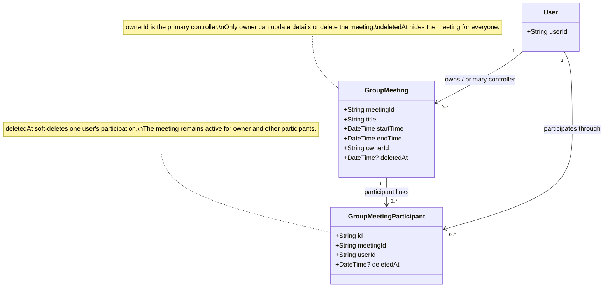
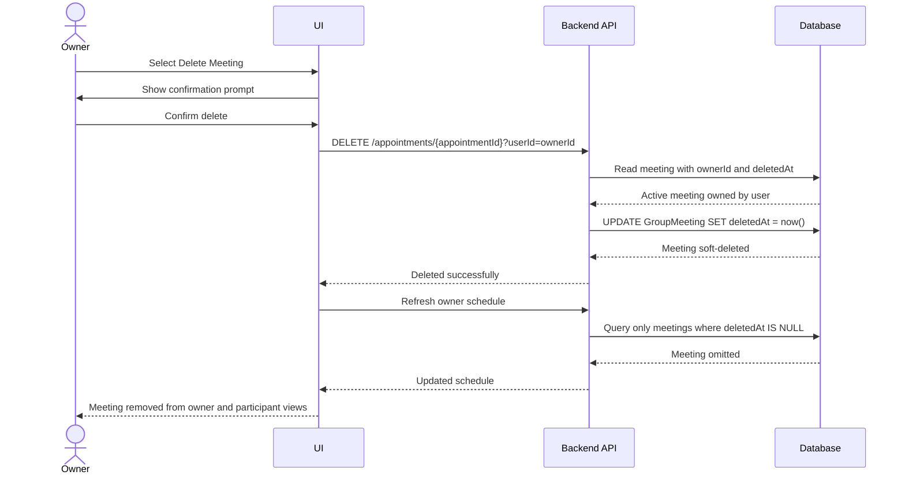

# Group Meeting CRUD Diagrams

## Class Diagram



## Sequence Diagram A: Owner Delete



## Sequence Diagram B: Participant Leave

```mermaid
sequenceDiagram
    actor Participant
    participant UI
    participant API as Backend API
    participant DB as Database

    Participant->>UI: Select Remove from Schedule
    UI->>Participant: Show alert / confirmation
    Participant->>UI: Confirm remove
    UI->>API: POST /appointments/group-meetings/{meetingId}/leave
    API->>DB: Read active GroupMeetingParticipant link
    DB-->>API: Link found and user is not owner
    API->>DB: UPDATE GroupMeetingParticipant SET deletedAt = now()
    DB-->>API: Participant link soft-deleted
    API-->>UI: Removed from schedule
    UI->>API: Refresh participant schedule
    API->>DB: Query active meetings with participant deletedAt IS NULL
    DB-->>API: Meeting omitted for that participant only
    API-->>UI: Updated schedule
    UI-->>Participant: Meeting removed from this user's view
```
